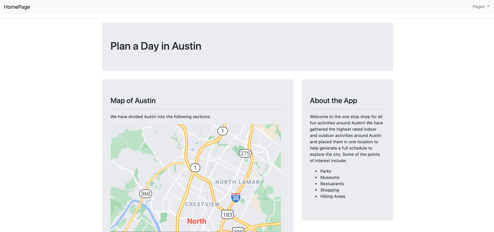
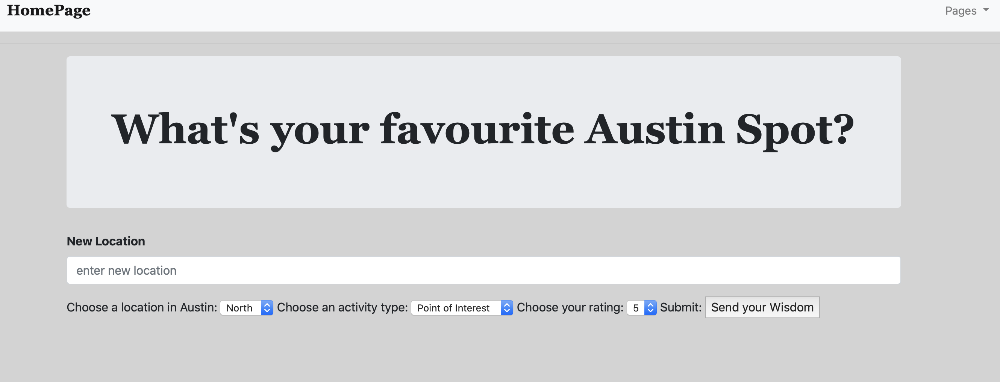
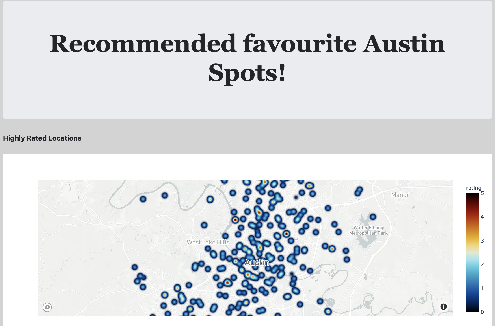

# Plan a Day in Austin

A Full stack web application that helps create a schedule of a day in Austin based on top recommended places!

Direct link to app: https://hip-cal-2.herokuapp.com/

### Project Goal
The goal of this project was to help the user filter the database based on their preferences and generate a list of fun activities to do around the city. We will be visualizing the highest rated areas in the city on dynamic maps. The user input page will allow the user to provide their favorite location and rating, which will then be added to the database. 

### Technologies and Packages used:

* Postgresql (Database)
* Bootstrap (Front-end framework)
* Heroku (Cloud platform)
* Mapbox
* Plotly
* HTML
* Python
* Flask
* JavaScript
* D3

### Home page 
The homepage shows a preview of the data, a map of Austin and a description of the app.

### User Input
This page will allow the user to contribute to our database with thier favorite location, rating and activity type.

### Visualization
This page includes a heat map of the highest rated locations in Austin.

### Result:

In this application we utilized the Google Places API to implement a search for the most popular attractions in Austin, Texas. Ultimately, Plan a Day in Austin allows the user to generate the highest rated activities to explore the city. Users can also submit recommendations to add to our database of popular spots in town to help spread the word of hidden gems around Austin. 

### Author
Akik Patel, Caroline Moeser, Ed Yancik, Natalia Saavedra, Zach Childers
